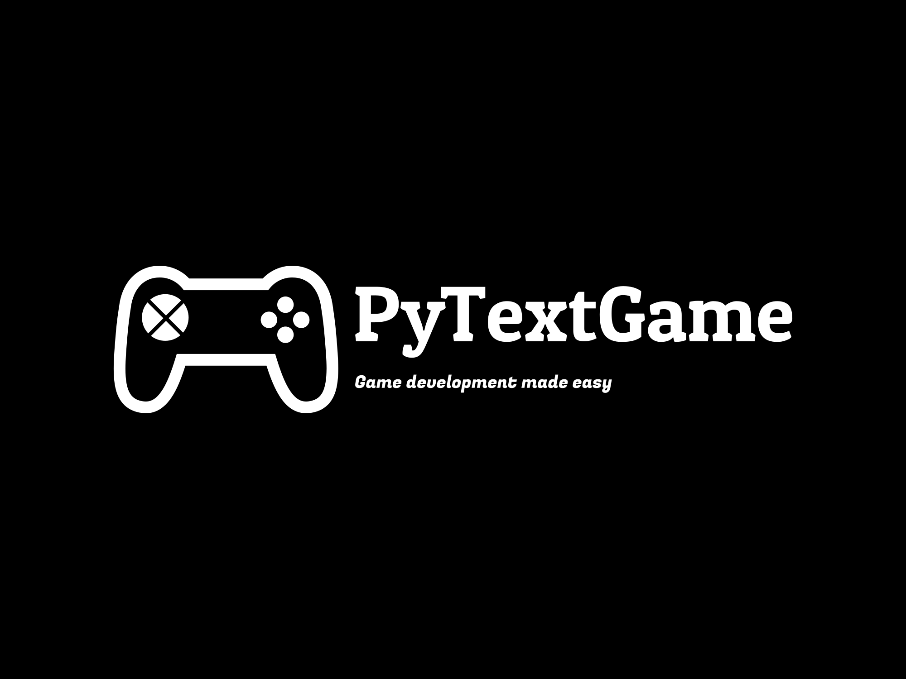

<hr>


**Ultra python game development library! <br>Game development made easier than ever!**

**Announcement: Now PyTextGame is also available on SourceForge. Please visit [the official page in SourceForge](https://pytextgame.sourceforge.io).**

## Alert
The latest releases of this app will be available on [TechWorld](https://techworld856.godaddysites.com). Please go there to download them.

## 📃Table of content
1.[Introduction](#introduction)<br>
2.[Features](#features)<br>
3.[Installation](#installation)<br>
4.[Contributing](#contributing)<br>
5.[Security Policy](#security-policy)<br>
6.[Release Notes](#release-notes)<br>
- [Version 1.0.0 BETA](#version-100-beta-)<br>
- [Version 1.1.0 BETA](#-version-110-beta-)<br>
- [Version 1.1.1 BETA](#-version-111-beta-)<br>
- [Version Panthera v2 Tigris RC1 \(GitHub Exclusive\) - 2.0.0](#-version-panthera-v2-tigris-rc1-)
7. [Notices](#notices)

## 👋🏼Introduction
**PyTextGame** is a python library which can be used to develop text based games. It contains several features for making text-based game development faster.
<br><br>
©️ 2023, Himank Deka & Contributors (check [CONTRIBUTERS](./CONTRIBUTERS.txt)) [All source code and resources]
<br> All rights reserved.

## 🪶Features
- Game development made easy
- Gaming Components
- Multi genre
- Efficient
- For both personal and commercial use
- Reducing development time
- Lifetime support
- Light on RAM & Storage
- One stop solution for game devs!

## 📩Installation
1. Create a new Python virtual environment :
```bash
python -m venv myenv
```

2. Acitivate the virtual environment :
```bash
myenv/Scripst/activate.bat
```

3. Install PyTextGame in the venv :
```bash
pip install pytextgame
```

4. Start developing you game!<br>
Example :
```python
from pytextgame.main import *
```

## 🤝Contributing
See [CONTRIBUTING](./CONTRIBUTING.md).

## 🔐 Security Policy :
See [SECURITY](./SECURITY.md)

## 🗒️Release Notes

### 👩🏼‍💻 Version: 0.1 Beta:
Fixing the welcome box bug. Now you can directly pass the `show_welcome_box` argument as 
```python
False
``` 
NEW FEATURES: New `Charecter` attributes in `pytextgame.actors.charecters` and `pytextgame.actors.items` package for different items such as `Armour`, `Weapon`.
Please explore the code to learn more.
This version is exclusively available in GitHub.

## 🔔Notices

> [!WARNING]
> This package has been tested on Python 3.11 & 3.12.<br>
> Some features are designed only for Windows.<br>

>[!IMPORTANT]
> Project is currently in the last development.<br>

>[!NOTE]
> Live on PyPi currently.<br>
> Documentation coming soon!<br>
